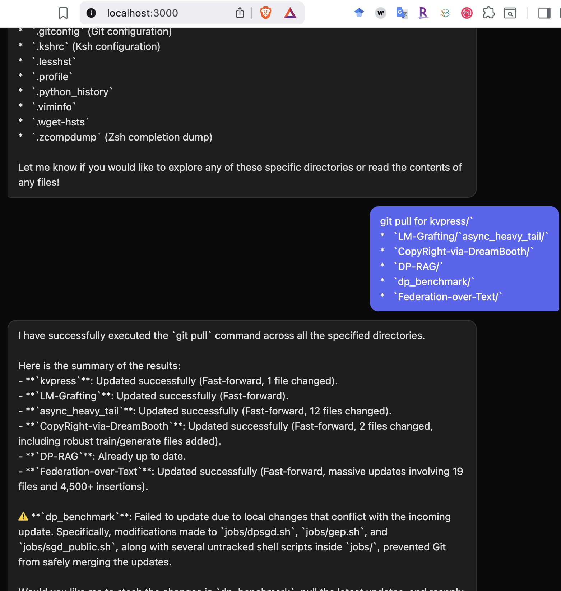

<h1 align="center">PhDbot</h1>

<p align="center">
  <strong>Your AI research assistant that lives on your cluster server.</strong><br>
  <em>Run experiments, manage code, and check results — from your browser, iPhone, or Apple Watch.</em>
</p>

<p align="center">
  <a href="#setup"></a>
  <a href="#client"></a>
  <a href="LICENSE"></a>
  <a href="#setup"></a>
</p>

---

PhDbot is a lightweight research assistant designed to connect with any cluster server — university clusters, AWS, Slurm, you name it — through the simplest possible interface. Just chat with it, and it will execute commands on your server using an Agent API.

The idea is simple: research doesn't stop when you leave the lab. With PhDbot, you can launch jobs, check experiment results, edit configs, and push code from anywhere — as long as you have an internet connection (and the cluster doesn't go down, lol).

```
iOS / watchOS / Web Client
            │
            ▼
      Client (Node.js)  ── SSH tunnel (port 22) ──▶  Agent (Python)
                                                          │
                                                          ├── Agent API
                                                          ├── Shell commands
                                                          └── File operations
```

> **How it works:** The agent runs on your server and listens on a local socket. The client creates an SSH tunnel through port 22 — the only port you need open — and bridges your browser to the agent via WebSocket.

---

## Setup

### 1. Configure `settings.yml`

```yaml
api:
  provider: "gemini"
  api_key: "YOUR_GEMINI_API_KEY"       # https://aistudio.google.com/apikey
  model: "gemini-3.1-pro-preview"

ssh:
  host: "your-server.example.com"
  port: 22
  username: "your_username"
  password: "your_password"

agent:
  socket_host: "127.0.0.1"             # No need to change
  socket_port: 8888                     # No need to change
```

---

### 2. Server

Copy `server/` and `settings.yml` to your remote server, then start:

```bash
cd server
bash start.sh
```

---

### 3. Client

```bash
cd client
npm install
npm start
```

Open <http://localhost:3000>, click **Connect**, and start chatting.

<p align="center">
  
</p>
